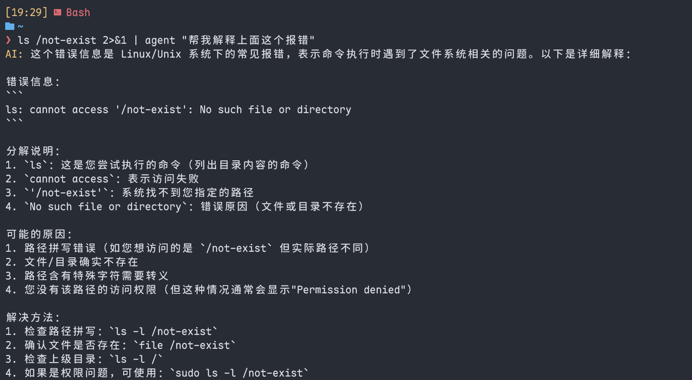

# Agent CLI

> 一个受绿导师《操作系统》课程启发的命令行 AI 玩具，支持对话、多轮上下文、文件/命令输出分析、流式响应、丰富指令等。


## 目录

- [特性](#特性)
- [安装](#安装)
- [快速开始](#快速开始)
- [配置方法](#配置方法)
- [用法示例](#用法示例)
- [常用命令](#常用命令)
- [FAQ](#faq)
- [许可证](#许可证)


## 特性

- 支持多轮对话、上下文记忆
- 支持流式输出、可随时中断
- 支持 `!bash` 命令，自动读取命令行输出进行解析
- 支持多文件加载与分析
- 自定义 system prompt
- 交互模式与管道/重定向模式自动切换
- 配置自动引导，API Key 热更新
- 丰富的命令行参数和特殊指令


## 安装

**建议 Python 3.8 及以上。**

1. 克隆项目

```bash
git clone https://github.com/KaiserTT/Agent-CLI.git
cd Agent-CLI
```

2. 安装依赖

```bash
pip install -r requirements.txt
```
或者直接安装本地包（推荐）：

```bash
pip install .
```


## 快速开始

### 启动交互式聊天

```bash
python -m agent_cli
```
或（如果 `setup.py`/`pip install .` 完成并配置了 entry_points）：

```bash
agent
```

首次运行会自动引导你填写 API Key、选择 LLM 提供商等。


## 配置方法

### 自动引导

首次运行时将自动交互式生成配置文件（如 `~/.agent_cli/config.json`）。

### 修改配置

- 配置文件位置可通过 `--config` 指定
- 示例配置（**请勿上传真实 key 到公网**）见 `config.example.json`
- 配置项包括：
  - `provider`: LLM 提供商
  - `api_key`: API 密钥
  - `base_url`: API 基础地址
  - `model`: 模型名称
  - `system_prompt`: 系统提示词

### 手动修改 API Key

- 在 CLI 中输入：
  ```bash
  !apikey sk-xxxxxxx
  ```
- 或直接编辑配置文件


## 用法示例

### 交互模式

```bash
python -m agent_cli
```

### 管道/重定向模式

将文件或命令输出作为 prompt：

```bash
cat your_code.py | agent "请分析上述代码"
ls /not-exist 2>&1 | agent "帮我解释上面这个报错"
agent < your_code.c "解释这份代码"
```



### 分析 bash 命令输出

CLI 中直接输入：

```bash
!bash gcc test.c -o test
```
随后可继续输入问题，自动将命令结果作为上下文。

### 多文件分析

CLI 中使用

```bash
!file a.py b.py "含有空格的文件.txt"
```


## 常用命令

- `help`           显示帮助
- `clear`          清空对话历史
- `exit` / `quit`  退出程序
- `!config`        显示当前配置
- `!system ...`    修改当前 session 的 system prompt
- `!provider ...`  切换 LLM 提供商
- `!model ...`     切换模型
- `!apikey ...`    更新 API Key
- `!bash ...`      执行 bash 命令并分析结果
- `!file ...`      加载文件内容进行分析
- `!save ...`      保存当前对话历史
- `!load ...`      加载历史对话（功能占位）


## FAQ

- **如何中断长回复？**  
  直接按 `Ctrl+C`。

- **如何切换 LLM 或 Key？**  
  用 `!provider` 或 `!apikey`，或重启并更改配置。

- **如何保存对话历史？**  
  用 `!save 路径`。

- **如何让 agent 分析上一个命令输出？**  
  用管道，或 `!bash` 命令。


## 许可证

本项目基于 MIT License 发布。详见 LICENSE 文件。


## 致谢

- [Deepseek](https://deepseek.com/)
- [OpenAI](https://openai.com/)


**有问题或建议欢迎提交 issue 或 PR！**
